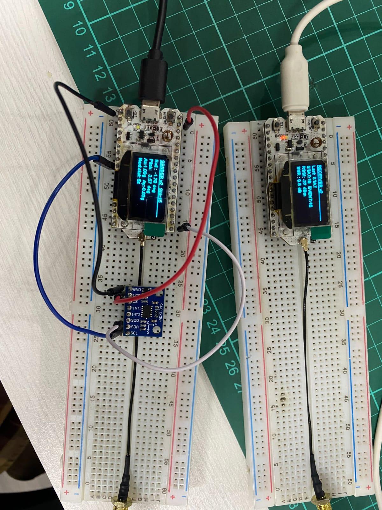
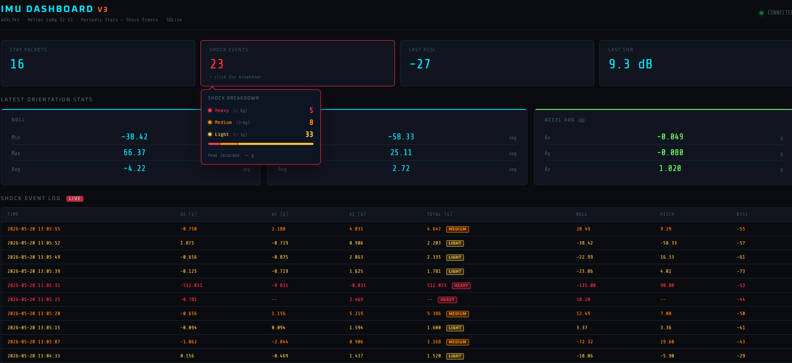

# 📡 Wireless Vibration & Shock Monitoring System
### ADXL345 · Heltec LoRa 32 V2 · Flask + SocketIO · SQLite

> An end-to-end wireless orientation monitoring and impact detection system — from physical sensor to real-time web dashboard — using LoRa 923 MHz as the transmission medium.

---

## 📸 Preview

### Hardware Setup


*Two Heltec LoRa 32 V2 nodes on breadboard. Left: Sender with ADXL345 connected via I2C. Right: Receiver forwarding data to PC via USB Serial. Each OLED displays live status.*

### Web Dashboard


*Dashboard showing 23 detected shock events (5 Heavy, 8 Medium, 33 Light), RSSI -27 dBm, SNR 9.3 dB. Breakdown popup displays a stacked bar of shock level distribution.*

---

## 🏗️ System Architecture

```
┌─────────────┐    I2C     ┌──────────────────┐
│  ADXL345    │──────────▶│  Sender MCU       │
│  100 Hz     │  GPIO21/22 │  Heltec V2 (ESP32)│
│  ±16g range │            │  + OLED display   │
└─────────────┘            └────────┬──────────┘
                                    │ LoRa 923 MHz
                                    │ SF7 · BW125 · TX 20dBm
                                    ▼
                           ┌──────────────────┐
                           │  Receiver MCU    │
                           │  Heltec V2       │
                           │  + OLED status   │
                           └────────┬─────────┘
                                    │ USB Serial 115200
                                    ▼
                           ┌──────────────────┐    WebSocket
                           │  Flask Server    │──────────────▶ Browser
                           │  Python          │
                           │  SQLite DB       │◀────────────── REST /api/*
                           └──────────────────┘
```

---

## ⚡ Key Features

### Firmware — Sender
| Feature | Details |
|---|---|
| **Dual I2C bus** | `TwoWire(1)` for ADXL345 (GPIO 21/22), `Wire(0)` for OLED — conflict-free |
| **Raw register read** | Reads 6 bytes directly from reg `0x32`, converts to g with divisor 32 |
| **Roll / Pitch** | Computed via `atan2` with no external IMU library |
| **Stat accumulator** | Accumulates min/max/sum over a 10-second window, resets after transmit |
| **Shock detection** | `√(Ax²+Ay²+Az²) > 2.0g` → sends EVENT packet, 2-second cooldown |
| **OLED live display** | Shows Roll, Pitch, Az, countdown to next STAT — refreshes every 500 ms |

### Firmware — Receiver
| Feature | Details |
|---|---|
| **Non-blocking receive** | `LoRa.parsePacket()` in main loop, no blocking delays |
| **RSSI + SNR append** | Every forwarded payload includes `,RSSI:-72,SNR:9.5` |
| **OLED status** | Stat count, Event count, last RSSI/SNR; shows NO SIGNAL after 15 s timeout |
| **Sync word** | `0xF3` — only accepts packets from the paired sender |

### Backend (Python)
| Feature | Details |
|---|---|
| **Serial daemon thread** | Auto-reconnects on Serial error or disconnect |
| **CSV key:val parser** | `extract()` — index-based parsing, no regex |
| **SQLite persistence** | `stats` & `events` tables, one insert per incoming packet |
| **SocketIO push** | Emits `"stat"` / `"event"` to all connected browsers in real time |
| **REST API** | `GET /api/stats` and `GET /api/events` — returns last 50 rows |

### Frontend (JavaScript)
| Feature | Details |
|---|---|
| **Live counters** | Stat packets, shock events, RSSI, SNR |
| **Shock classifier** | Light / Medium / Heavy based on total-g threshold |
| **Breakdown popup** | Stacked bar per category + peak-g tracker |
| **History on connect** | Fetches REST API on connect — loads last 50 records from DB |
| **Row color coding** | Red (Heavy), Orange (Medium), Yellow (Light) |

---

## 📦 Packet Format

### STAT Packet (every 10 seconds)
```
TYPE:STAT,RMin:-1.23,RMax:2.45,RAvg:0.67,PMin:-0.89,PMax:1.12,PAvg:0.23,
AXAvg:0.012,AYAvg:-0.003,AZAvg:0.998,CNT:1000
```
After the receiver forwards it to the PC:
```
Recv:TYPE:STAT,...,CNT:1000,RSSI:-61,SNR:9.5
```

### EVENT Packet (real-time trigger)
```
TYPE:EVENT,AX:0.123,AY:-0.456,AZ:2.187,R:12.34,P:-5.67
```

### Shock Classification Thresholds (client-side)
| Level | Total-g | Color |
|---|---|---|
| **Light** | < 3.5 g | Yellow |
| **Medium** | 3.5 – 5.0 g | Orange |
| **Heavy** | ≥ 5.0 g | Red |

---

## 🔌 Wiring ADXL345 → Heltec LoRa 32 V2

```
ADXL345 Pin   →   Heltec GPIO    Notes
──────────────────────────────────────────────────
SDA           →   GPIO 21        I2C bus 1 (TwoWire 1)
SCL           →   GPIO 22        I2C bus 1 (TwoWire 1)
VCC           →   3.3V
GND           →   GND
SDO           →   GND            Sets I2C address to 0x53
CS            →   3.3V           Enables I2C mode (not SPI)
```

> **Why TwoWire(1)?**
> The Heltec LoRa 32 V2 uses `Wire` (bus 0) internally for the OLED on SDA=4, SCL=15. Using `TwoWire(1)` on GPIO21/22 places the ADXL345 on a completely separate bus, avoiding any address conflict.

---

## ⚙️ LoRa Configuration

| Parameter | Value |
|---|---|
| Frequency | 923 MHz (AU915 / AS923 band) |
| Spreading Factor | SF7 |
| Bandwidth | 125 kHz |
| Coding Rate | 4/5 |
| TX Power | 20 dBm |
| Sync Word | 0xF3 |

---

## 🛠️ Tech Stack

| Layer | Technology |
|---|---|
| **MCU** | ESP32 (Heltec LoRa 32 V2) |
| **Sensor** | ADXL345 via raw I2C |
| **Wireless** | LoRa (`arduino-LoRa` library) |
| **Display** | SSD1306 OLED via `ESP8266 and ESP32 OLED driver` |
| **Backend** | Python 3 · Flask · Flask-SocketIO · PySerial |
| **Database** | SQLite (via `sqlite3` stdlib) |
| **Frontend** | Vanilla JavaScript · Socket.IO client |
| **Fonts** | Share Tech Mono · Oxanium (Google Fonts) |

---

## 🚀 Getting Started

### 1. Flash Firmware

Upload `ADXL345_Heltec_SENDER.ino` to the first Heltec node (with ADXL345 attached), and `ADXL345_Heltec_RECEIVE.ino` to the second node using Arduino IDE.

Required libraries (install via Arduino Library Manager):
- `LoRa` by Sandeep Mistry
- `ESP8266 and ESP32 OLED driver for SSD1306` by ThingPulse

### 2. Install Python Dependencies

```bash
pip install flask flask-socketio eventlet pyserial
```

### 3. Set the Serial Port

Open `app.py` and update:
```python
SERIAL_PORT = "COM6"   # Windows: COMx  |  Linux/Mac: /dev/ttyUSBx
```

### 4. Run the Server

```bash
python app.py
```

### 5. Open the Dashboard

```
http://localhost:5000
```

---

## 📁 Project Structure

```
project/
├── ADXL345_Heltec_SENDER.ino    # Sender firmware (ESP32 + ADXL345)
├── ADXL345_Heltec_RECEIVE.ino   # Receiver firmware (ESP32)
├── app.py                        # Flask backend + serial reader
├── templates/
│   └── index.html                # Dashboard HTML
└── static/
    ├── css/
    │   └── style.css             # Dark theme styling
    └── js/
        └── dashboard.js          # SocketIO + UI logic
```

---

## 🗃️ SQLite Schema

**`stats` table** — stores every STAT packet:
```sql
id, timestamp, roll_min, roll_max, roll_avg,
pitch_min, pitch_max, pitch_avg,
ax_avg, ay_avg, az_avg, sample_count, rssi, snr
```

**`events` table** — stores every shock event:
```sql
id, timestamp, acc_x, acc_y, acc_z, roll, pitch, rssi, snr
```

---

## 📝 Notes

- The ADXL345 has no magnetometer → **Yaw is not available**
- The ADXL345 has no temperature sensor → **Temperature is not displayed**
- Roll and Pitch are computed from static acceleration data (suitable for orientation, not fast motion)
- For production use, consider adding LoRa payload encryption

---

## 👤 About

This project was built as a full end-to-end IoT monitoring system, demonstrating the integration of embedded firmware (C++ / Arduino), long-range LoRa wireless communication, a Python backend with persistent storage, and a real-time web dashboard.

**Tags:** `embedded-systems` `iot` `lora` `adxl345` `esp32` `flask` `real-time-monitoring` `accelerometer` `heltec`
